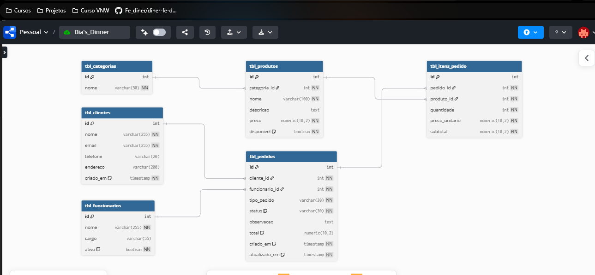

# Sistema de Pedidos - Lanchonete (PostgreSQL)

## 📌 Sobre o Projeto

Este projeto consiste na modelagem e implementação de um banco de dados para gerenciamento de pedidos em uma lanchonete, utilizando PostgreSQL.

A solução substitui o controle manual por uma estrutura organizada, permitindo maior controle sobre pedidos, clientes e produtos.

---

## 🎯 Objetivo

* Centralizar o registro de pedidos
* Modelar um banco de dados relacional consistente
* Garantir integridade dos dados
* Permitir consultas úteis para operação do negócio

---

## 🧠 Regras de Negócio

O sistema contempla:

* Cadastro de clientes
* Cadastro de produtos e categorias
* Cadastro de funcionários
* Registro de pedidos com:

  * Tipo (BALCAO, RETIRADA, DELIVERY)
  * Status (PENDENTE, EM_PREPARO, PRONTO, ENTREGUE, CANCELADO)
* Associação de múltiplos itens por pedido
* Controle de valores por item e por pedido

---

## 🏗️ Modelagem do Banco

**Entidades principais:**

* tbl_clientes
* tbl_categorias
* tbl_produtos
* tbl_funcionarios
* tbl_pedidos
* tbl_itens_pedido

**Relacionamentos:**

* Um cliente pode realizar vários pedidos
* Um pedido possui vários itens
* Um produto pertence a uma categoria
* Um pedido é atendido por um funcionário
* Um item está vinculado a um produto e a um pedido

---

## ⚙️ Tecnologias Utilizadas

* PostgreSQL
* SQL (DDL, DML e consultas)
* pgAdmin
* dbdiagram.io

---

## 🔗 Diagrama

A modelagem pode ser visualizada em:
👉 (https://dbdiagram.io/d/Bias_Dinner-69d6ce910f7c9ef2c0afa0e6)

---

## 🗃️ Estrutura do Banco

O banco foi estruturado com:

* Chaves primárias auto incrementais
* Chaves estrangeiras (integridade referencial)
* Constraints (NOT NULL, UNIQUE e CHECK)
* Timestamps para rastreabilidade
* Automatização de cálculos:

  * Subtotal calculado automaticamente por item
  * Total do pedido atualizado via trigger

---

## 📊 Consultas

O projeto inclui consultas como:

* Listagem de pedidos com cliente
* Detalhamento de itens por pedido
* Visualização de pedidos com produtos
* Consulta de faturamento por período

---

## 🧪 Dados de Teste

Foram inseridos dados fictícios para simular:

* Clientes
* Produtos
* Pedidos

Permitindo validar o funcionamento completo do sistema.

---

## 🚀 Como Executar

1. Criar um banco de dados no PostgreSQL
2. Executar o arquivo `desafio-backend-lanchonete.sql`
3. Executar as consultas para validação

---

## 📈 Possíveis Melhorias

* Implementação de API backend
* Controle de estoque
* Dashboard de vendas
* Normalização de status em tabela própria

---

## 👨‍💻 Autora

Beatriz Teodoro
